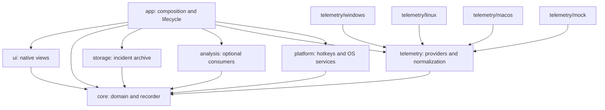
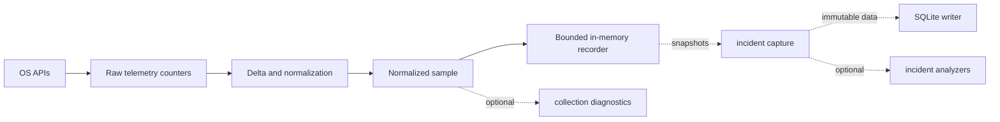
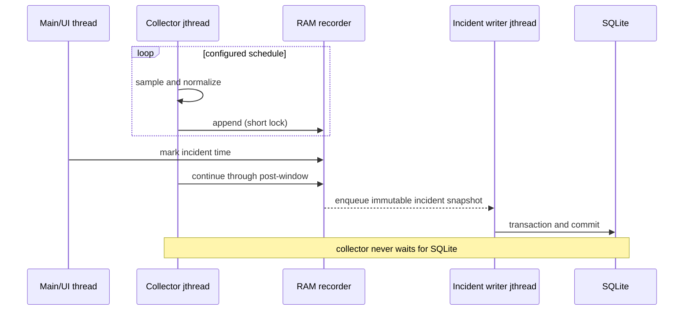

# BlackBox architecture

## Architectural goals

BlackBox records enough recent system behavior to explain transient incidents while remaining measurably cheaper than the workloads it observes. The design isolates OS APIs, bounds memory, performs no normal recording-time database writes, and keeps optional consumers out of the collection path.

## Modules and dependency rules

Rules:

1. `core` owns platform-independent domain types, recorder behavior, clocks, and diagnostics contracts. It cannot include SDL, SQLite, ImGui, or OS headers.
2. `telemetry` owns raw counters, provider contracts, normalization, and provider capabilities. Only OS-specific subdirectories may include Win32, `/proc`, or Mach headers.
3. `platform` owns OS services that are not telemetry, notably global hotkeys. It follows the same interface/implementation split.
4. `storage` accepts immutable incident snapshots. It cannot poll telemetry or block the collector.
5. `analysis` consumes normalized incidents. Collection and recording cannot depend on analysis.
6. `ui` observes core state and emits commands. The recorder cannot depend on UI lifetime or frame rate.
7. `app` is the composition root and may depend on all modules to wire concrete implementations.

`windows.h` is forbidden outside Windows implementation directories unless an exception is documented. Unsupported metrics are data, not failures: callers consult `PlatformCapabilities` and tolerate absent values.

## Telemetry pipeline

Raw provider output preserves cumulative counter precision and a monotonic observation time. The normalization layer compares consecutive observations, rejects invalid intervals, handles resets/wraps, and produces explicit units such as fraction, bytes/second, and operations/second. The recorder sees only normalized, platform-independent values.

Static `ProcessInfo` is separated from time-series `ProcessSample`. Metadata is cached and refreshed on process lifecycle changes or a slow tier, never resolved every fast sample. A future process identity must combine PID with a creation-time token to prevent PID reuse from merging unrelated processes.

Sampling tiers are a scheduler concern, not a property of the normalized sample schema:

- Fast: CPU, disk, and network counters.
- Normal: memory and process activity.
- Slow/event-driven: process paths and system metadata.

V0.0.2 defines these contracts. `ITelemetryProvider::sample` writes into a caller-owned `RawTelemetrySnapshot`, clearing logical contents while retaining vector capacity. `SamplingRequest` carries a set of fast, normal, and slow tiers without introducing a scheduler. Providers report a coarse sample result while each metric independently carries `available`, `unsupported`, `inaccessible`, or `temporarily_unavailable` state.

Normalized units are explicit value types: `Ratio` is a fraction in `[0,1]`, `ByteCount` is bytes, and `BytesPerSecond` is bytes/second. CPU counters contain cumulative busy and total ticks in a common provider-defined tick unit. CPU utilization is `busy_delta / total_delta`, representing the fraction of total machine capacity busy during the interval. A future Windows provider will derive busy ticks as total minus idle before emitting raw data.

`ProcessIdentity` combines PID and a provider creation token. `ProcessInfo` owns slow metadata; `RawProcessCounters` and `ProcessSample` contain time-varying data. Process normalization/state is intentionally deferred until process collection in V0.0.6, but its portable data boundary is established now.

Opt-in process lifecycle evidence remains on the same boundary: the Windows provider derives
start/exit observations from its existing full-identity enumeration, and the portable collector
may forward only normalized `(PID, creation token, kind, monotonic time)` records through an
`ISystemEventSink` into the separate bounded event recorder. Initial inventory and uncertain
resynchronization observations are suppressed. The event cannot request capture, alter anomaly or
contributor scores, or manufacture a diagnosis. Incident construction joins in-window context and
referenced metadata; downstream contributor output may report an exact identity-matched start/exit
time separately from anomalous-activity onset. This adds no storage, UI, analysis, or second
native-enumeration dependency to the collection path.

## Recorder pipeline

The recorder is a fixed-capacity ring buffer sized from history duration and base interval (initially 300 samples for five minutes at one second). Capacity is fixed during a recording configuration epoch. Appends overwrite the oldest sample in constant time. Snapshot extraction returns samples in chronological order.

The first implementation uses `std::mutex` around short recorder operations. Lock-free structures are prohibited until benchmarks show contention is material. UI readers receive copied or immutable snapshots rather than holding the collector lock while rendering.

The recorder does not know about SQLite, views, or analyzers. It can run headless with a provider, normalizer, clock, and scheduling loop.

## Threading model

- Main/UI thread: SDL events, native rendering, user commands. When hidden, rendering should be event-driven or aggressively throttled.
- Collector `std::jthread`: schedules sampling with a monotonic clock and cooperative stop. No SQLite or UI calls.
- Writer `std::jthread`: waits on a bounded work queue, writes one transaction per incident, and reports failures without crossing the thread boundary with exceptions.
- Viewer `std::jthread`: performs paginated archive queries, selected-incident loads, annotation updates, and large view-model construction; the render loop consumes immutable display snapshots and never calls SQLite.

Shutdown order stops new captures, requests collector stop, joins it, drains or explicitly cancels writer work according to policy, joins the writer, closes SQLite, then destroys UI/platform resources. Ownership is RAII and rooted in `app`.

## Incident pipeline

A manual capture records event time `T`, retains the requested pre-window, and waits for the post-window. Defaults are `T - 120 s` through `T + 30 s`. Completion creates an immutable value object containing metadata, normalized system samples, referenced process metadata, and process samples. Multiple captures need an explicit merge/queue policy before implementation.

The global hotkey is exposed through an `IGlobalHotkeyManager`-style platform interface. Its callback emits a core command; Win32 message-loop details remain in `platform/windows`.

## Storage architecture

SQLite is an incident archive, never the live recorder. Logical tables hold schema metadata, incidents, system samples, process identities/metadata, and process samples. Before the first public release the complete layout is created directly as schema version 1 and non-v1 archives are rejected unchanged. Prepared statements insert one whole incident per transaction, so a failure rolls back every row from that attempt.

The pre-release direct-v1 rule is also a build contract. A platform-independent CTest check pins the
archive schema plus all eleven persisted settings/export/evaluation format constants to version 1,
requires exactly one `PRAGMA user_version=1` schema publication, and rejects production migration,
legacy-reader, compatibility-reader, or alternate-schema tokens. Behavioral tests separately prove
that valid product and recorder settings rewritten as format 2 are rejected rather than converted.
This guard is downstream test infrastructure and introduces no runtime dependency.

Database errors produce observable incident-writer status and leave the collector running. The archive uses WAL with `synchronous=FULL`, a 1 GiB default logical growth limit, and no automatic deletion or corrupt-database replacement. `docs/STORAGE.md` specifies the schema, location, durability, size, and recovery contracts.

Direct V1 identity is the complete canonical SQLite layout, not only `PRAGMA user_version`. On every
open, storage constructs the current schema in an isolated in-memory connection and compares the
ordered non-internal table/index definitions, application ID, metadata row, and required singleton
control state with the candidate archive. Restore performs the same comparison through a read-only
source connection before it creates a safety copy or changes the active archive. Missing, extra, or
altered development objects are rejected unchanged for explicit recreation; there is no conversion
or compatibility path. This is open/maintenance work and never enters normal recording or the
collector dependency graph.

## Platform abstraction

Provider selection happens in `app`. Core code sees capabilities and normalized values, not build macros or native handles. Windows remains the only supported production backend. Mock scenarios support deterministic development on every build host. Linux has an engineering provider for system CPU/memory/disk/network/power/uptime, capability-driven GPU evidence, and process CPU/memory/I/O behind the same interface. Its native desktop target and explicitly labeled TGZ, DEB, and RPM engineering packages are built, measured, extracted, and smoke-tested across Ubuntu, Debian, and Fedora hosted containers. Linux platform services supply a native SDL tray boundary, a per-user instance lock, exact XDG autostart ownership, bounded freedesktop notifications, a Wayland global-shortcut boundary, and nonblocking increased-contrast/reduced-motion reads through the XDG Desktop Portal. Unavailable desktop protocols keep the window visible and remain explicit. macOS has an engineering provider for system CPU/memory/disk/network/power/uptime and process CPU/memory/I/O using Mach, sysctl, libproc, BSD interface counters, and IOKit behind the same telemetry interface. It exposes public non-identifying Metal inventory and render-device availability, but not passive whole-system GPU utilization. All native APIs remain confined to `telemetry/<os>` or `platform/<os>` and neither backend changes the collector dependency graph. These are hosted engineering boundaries, not physical qualification or product-support claims.

Candidate Windows APIs are documented in `docs/TELEMETRY.md`; candidates remain uncommitted until measured for accuracy, overhead, privilege behavior, and supported Windows versions.

## Future analysis boundary

Analysis begins only after V0.1 and consumes a complete normalized `Incident`. A future `IIncidentAnalyzer` returns ranked evidence and uncertainty. Statistical baselines precede ML. Optional ONNX Runtime inference may be introduced only after evaluation demonstrates added value, and it must not enter the recorder dependency graph.

Cause candidates must use probabilistic language. Temporal correlation and anomaly magnitude are evidence, not proof of causation.

## V0.0.1 implementation note

The bootstrap links SDL3's renderer, the matching Dear ImGui backends, and ImPlot. This is the smallest cross-platform native rendering path and avoids a custom graphics backend. SQLite is resolved behind a storage dependency target but deliberately has no runtime storage code yet. Logging is a small replaceable sink in `core`; records are component-tagged, single-line, bounded to 2,048 message bytes, and elapsed-time stamped by the default sink. Sink callbacks run outside logger ownership locks so a test or future adapter may safely reenter. A heavier logging framework is not justified at this stage.

`FindSQLite3` changed its canonical imported-target spelling across supported CMake generations.
The root build resolves either `SQLite3::SQLite3` or `SQLite::SQLite3` once and exposes only
`BlackBox::StorageDependencies` downstream. Platform and storage code therefore remain insulated
from package-manager and CMake-version naming differences. Hosted workflows bootstrap vcpkg in an
ephemeral checkout-sibling directory, outside the checkout, so dependency setup cannot dirty the
source tree or invalidate the revision embedded in release binaries.

Existing nonempty archive files are inspected read-only for the exact SQLite header before SQLite
receives the path. This prevents platform-specific SQLite handling of tiny malformed files from
turning rejected input into a newly initialized database. Direct-v1 schema validation still follows
for every structurally valid SQLite file; malformed input is rejected without byte modification.

The hosted Windows matrix maps runner toolchains explicitly: Windows Server 2022 exercises the
Visual Studio 2022 presets and Windows Server 2025 exercises the Visual Studio 2026 preset. Runner
labels do not imply that an older Visual Studio generator remains installed.

Hosted Linux instrumentation also names its C++23 library/toolchain pairing explicitly. UBSan uses
the installed GCC 14 compiler and libFuzzer uses Clang 18 with the runner's libstdc++. The fuzz-only
configuration supplies the C++20 concepts feature-test value required by that libstdc++ release to
expose `std::expected`; selecting libc++ 18 is not valid because that library lacks the product's
`jthread` and `stop_token` surface. Workflow actions remain immutable full-SHA dependencies and
track Node 24-compatible checkout, artifact, and CodeQL releases.

## V0.0.2 implementation note

The telemetry target depends only on core. UI and future storage dependency lookup can be disabled independently, and a headless Release build is part of milestone validation. `SystemTelemetryNormalizer` stores one scalar prior observation; scalar helpers are `noexcept` and use no dynamic storage. The first cumulative observation establishes a baseline. Non-monotonic timestamps, decreasing counters, zero total deltas, and invalid gauges return `temporarily_unavailable`; counter wrap is never inferred without a proven counter width. A non-monotonic observation does not replace the last valid baseline.

The mock provider advances deterministic cumulative counters and supports normal, CPU spike, disk spike, network drop, and process spike scenarios. Its clock is injected through `IMonotonicClock`; test code controls time without sleeping. This remains development telemetry, not a scheduler or recorder.

## V0.0.3 implementation note

`blackbox_telemetry_windows` is the only target that implements real collection. Its implementation includes `windows.h`; its public header and conversion tests use portable integer fixtures. `WindowsTelemetryProvider` reads cumulative CPU with `GetSystemTimes` and physical-memory gauges with `GlobalMemoryStatusEx`. Kernel time includes idle, so the provider emits `total = kernel + user` and `busy = total - idle`. Inconsistent or overflowing native fixtures become temporarily unavailable instead of producing a percentage.

`GetSystemTimes` aggregates all logical processors only on systems with at most 64 processors. On larger systems it covers the primary processor group of the calling thread. V0.0.3 exposes this as a documented limitation rather than pretending the result is whole-machine utilization. A future topology-aware source must preserve the same raw busy/total contract.

Until V0.0.4 introduces the collector `jthread`, `app` performs one provider call per second on the UI thread and immediately passes the raw snapshot through `SystemTelemetryNormalizer`. This temporary scheduling logic lives only in the composition root. It skips missed deadlines instead of issuing catch-up bursts. Hidden or minimized windows stop rendering and wait on SDL events in bounded intervals while telemetry continues.

The UI receives a `DashboardState` view model made of display-ready primitive values; it does not include telemetry or Win32 headers. Provider failures remain per-sample states. The app logs only status transitions, preventing a persistent failure from creating a one-message-per-second storm.

Collection timing uses a fixed 256-entry array. Recording is constant-time and allocation-free. Summary calculation copies and sorts the bounded array only after a sample, producing average, nearest-rank P50/P95/P99, and maximum durations for display. V0.0.4 moves this instrumentation into collector diagnostics without changing the provider.

## V0.0.4 implementation note

`core::CircularRecorder<T>` implements the storage policy without depending on telemetry. It allocates one vector at the start of each configuration epoch, appends in constant time under a short `std::mutex`, overwrites the oldest element when full, and treats capacity zero as a discard-only buffer. Reconfiguration clears history and increments the epoch; samples from different cadences are never mixed. A `RecorderSnapshot<T>` owns a chronological copy and exposes only a const span. Callers bound copy work with an explicit maximum sample count.

`telemetry::TelemetryCollector` owns the provider-to-normalizer scheduling loop and writes only normalized `SystemSample` values to the core recorder. Its `std::jthread` starts from monotonic deadlines and uses cooperative stop-aware waits. If collection reaches or passes a later scheduled tick, every elapsed tick is counted as dropped and the deadline advances directly to the first future tick; the provider is never polled in a catch-up burst. Exceptions become explicit unavailable samples, while provider status changes are logged only on transitions.

The default configuration is one second for five minutes, or 300 samples. Positive intervals and histories are required, capacity uses ceiling division, and a configuration epoch is capped at 86,400 system samples (about 11.2 MiB of current sample payload). The same configuration contract accepts 500 ms and 250 ms intervals. Before its first deadline, the collector invokes one provider hook on its own worker; Windows may raise only that current thread to `THREAD_PRIORITY_HIGHEST` (never real-time), while the portable default is a no-op success. Whether preparation succeeded is explicit diagnostic evidence. Diagnostics retain bounded 256-observation windows for collection time and scheduling jitter and count collections, partial/failing samples, late starts, deadline misses, dropped ticks, ring overwrites, and utilization. A separate fixed 256-event scheduling buffer records only drop episodes: the exact monotonic observation, collection index, deadline overrun, and dropped-tick count. Its storage is allocated once with the collector and is not copied into the 4 Hz ordinary diagnostics snapshot. It allocates nothing and performs no I/O on the collector path; overflow is explicit rather than silently replacing older evidence. The downstream application requests a bounded copy only after collection stops.

The app remains the lifecycle composition root: it owns the provider before the collector, starts collection after initialization, and stops/joins the collector before destroying UI resources. The UI copies at most 300 chronological samples at 4 Hz into fixed display arrays, never retains the recorder mutex, and has no telemetry dependency. The collector target operates with application, UI, SQLite, storage, and analysis targets absent and contains no recording-time file-write path.

## V0.0.5 implementation note

Disk and network collection remains inside `blackbox_telemetry_windows`; only that target includes PDH, IP Helper, Winsock, or Windows headers. A private provider-owned native state keeps one persistent shared fast-tier PDH query, so disk throughput/quality, GPU, and responsiveness counters require one collection rather than four independent collections per tick. The public Windows boundary exposes integer counter fixtures and injectable callbacks, not native handles. The app still composes provider, normalizer, recorder, and primitive `DashboardState`; the UI has no telemetry dependency.

Per-disk and per-interface native values pass through a fixed-capacity, OS-header-free lifecycle tracker before entering `RawSystemCounters`. It emits synthetic monotonic cumulative totals from stable-entity deltas, preventing device arrival/removal/reappearance and reset from changing aggregation membership into a false spike. The portable normalizer remains the only component that converts those totals to rates using measured monotonic time. The recorder consequently continues to receive normalized samples only and performs no disk writes.

The Windows network hot path never performs whole-table connectivity discovery. Provider construction establishes a bounded hardware-interface inventory; serialized IP Helper change callbacks rebuild it outside the collector, and the collector copies it under a short mutex before querying only known rows. A separate connectivity-hint callback updates an atomic aggregate level. Callbacks cannot access normalization, recording, incidents, storage, application commands, or UI. Inventory overflow and native query failure remain explicit unavailable evidence rather than silently omitting interfaces.

## V0.0.6 implementation note

Windows process enumeration and queries live entirely in `telemetry/windows`. Tool Help produces candidate PIDs and lifecycle metadata; `GetProcessTimes` creation time completes the portable `ProcessIdentity`. Native code emits cumulative counters and cached `ProcessInfo`, while `ProcessTelemetryNormalizer` alone computes total-machine CPU and measured-time I/O rates. PID-only state is prohibited.

Process history is a parallel `CircularRecorder<ProcessFrame>`, not a vector added to `SystemSample`. This keeps the existing system-ring snapshot cheap for the 4 Hz dashboard and gives future incident capture an independently bounded process stream. Recorder frames contain normalized `ProcessSample` values only. Static metadata remains in a separate retention cache keyed by full identity and survives exit for at most the configured history.

Normal process counters run with the normal tier. Executable paths run on an independent default 30-second slow cadence and are cached per identity; normal sampling does not resolve paths. Provider-native metadata is capped at 8,192 active identities, collector metadata at 8,192 retained identities, and recorded process history at 600,000 entries across the configuration epoch. Truncation and inaccessible/exit observations are diagnostics. UI receives only a primitive, display-ready top-50 table and has no telemetry or Win32 dependency.

## V0.0.7 implementation note

`core::IncidentCaptureCoordinator` owns the portable capture state and bounded immutable-work FIFO. It accepts one pending post-window; overlapping requests merge by retaining the earliest start and extending to the latest requested end. A fixed capacity of two counts queued and in-progress snapshots, so absent or slow storage cannot create unbounded capture memory. The core `IncidentSnapshot` has no telemetry dependency and exposes normalized system/process values through const spans only. Future storage receives `shared_ptr<const IncidentSnapshot>` work items.

The collector remains the only component that touches both recorder rings. After appending the first sample at or beyond a pending end, it copies only the bounded number of newest frames that can intersect the requested window, filters them by monotonic observation time, flattens process frames, and retains only referenced metadata. Construction time is included in normal collection timing and in a separate bounded diagnostic window; allocation failure becomes an observable snapshot failure without terminating collection.

The UI emits a primitive `DashboardCommand` and observes primitive capture status. It does not reference telemetry, incidents, or Win32. `IGlobalHotkeyManager` is a platform-independent callback interface. Its Windows implementation alone includes `windows.h`, owns the `RegisterHotKey` message thread, and unregisters/joins before the app stops the collector. V0.0.7 intentionally enqueues but does not consume incident work: SQLite and the asynchronous writer remain V0.0.8 responsibilities, and normal recording still performs no storage writes.

## V0.0.8 implementation note

`core::IIncidentWorkSource` is the only handoff visible to storage. The collector exposes this interface but storage cannot call, include, or poll telemetry. `IncidentWriter` owns a `std::jthread`, waits cooperatively for immutable work, and holds at most one incident beyond the core two-slot queue. Archive errors terminate only that write attempt, move writer diagnostics to degraded state, and never cross the thread boundary or stop collection. Normal rolling collection has no archive call.

`SqliteIncidentArchive` owns one serialized connection. Schema v1 normalizes incident headers, system samples, full process identities/metadata, and process samples, with foreign keys and deterministic order indexes. Availability states and explicit units survive round-trip; exact eight-byte blobs preserve unsigned 64-bit identities and counts that SQLite signed integers cannot represent. A single immediate transaction makes partially persisted incidents impossible.

The default Windows archive is `%LOCALAPPDATA%\BlackBox\incidents.sqlite3`. Foreign keys, WAL, `synchronous=FULL`, a 250 ms busy timeout, a 1,000-page automatic checkpoint, and a 1 GiB logical growth cap are configured explicitly. Unversioned non-empty, non-v1, and corrupt archives are refused without modification. Shutdown unregisters hotkeys, stops and joins the collector, drains and joins the writer, closes SQLite, then tears down the UI.

## V0.0.9 implementation note

The pre-release schema-v1 baseline includes bounded label/note columns and an incident label/time index. Repository discovery is hard-capped at 100 rows per call; the app requests 50-row pages and searches labels/notes in SQLite. Only one recorder-bounded incident is loaded for detail. Creation timestamps remain UTC epoch milliseconds and are displayed explicitly as UTC, while monotonic sample times become seconds relative to an event marker at zero.

`IncidentViewerService` lives at the application composition boundary because it coordinates storage and UI-facing view models. Its `std::jthread` performs every list/load/edit operation and constructs immutable `IncidentViewerContent`; the UI swaps a shared pointer and never includes SQLite or telemetry. Viewer queries share the archive's serialized connection with the writer but have no path to the collector, so database contention cannot stop recording.

System and selected-process plots retain at most 2,048 points per metric. Larger series use chronological min/max buckets that preserve both extrema, first, and last points rather than averaging away brief spikes. Availability counts remain explicit and unavailable values are never plotted as zero. Process aggregation keys on full PID/creation-token identity; rendering exposes at most 500 filtered/sorted identities from the existing 8,192-identity incident bound.

## V0.1 implementation note

The release collector treats a monotonic scheduling gap of five seconds or more as suspend/resume,
not ordinary jitter. It resets system and process delta baselines before the resumed observation,
restarts cadence from the wake time, forces the slow metadata tier, and records the gap/event and
estimated skipped ticks separately. Provider failure likewise invalidates delta baselines; the
next valid observation warms them before rates resume. Worker entry catches every exception so no
exception crosses a thread boundary, and a failed thread start rolls back accepting/running state.

Transient archive failures degrade only the writer. A later successful transaction restores its
ready state and increments recovery diagnostics; collection never participates in retry or archive
reopen logic. Startup exceptions are caught at the executable boundary. Shutdown retains the
hotkey, collector, viewer, writer-drain, archive, UI order documented above.

The release graph adds no analysis target or dependency. The architecture check forbids portable
telemetry from including analysis, app, storage, or UI. CI builds the full Debug/Release graphs and
a separate UI/storage-disabled collection graph. CPack derives runtime DLLs from the executable
target and creates a portable ZIP. Representative SQLite data is generated from source fixtures at
the current schema rather than storing a binary database that can drift behind schema changes.

## V0.2 implementation note

`blackbox_analysis` depends only on `blackbox_core` and consumes `const IncidentSnapshot`; it has no
telemetry, provider, recorder, storage, UI, platform, or OS dependency. `IIncidentAnalyzer` returns
ranked resource/process evidence and uncertainty through portable value types. The statistical
implementation uses bounded rolling median/MAD/IQR/percentile baselines. It never mutates or
persists an incident and has no background thread of its own.

The application composition root optionally constructs the analyzer. `IncidentViewerService`
invokes it on the existing viewer worker after SQLite load, translates results into primitive UI
rows, and preserves the result while rebuilding a selected-process timeline. Analysis error or
cold start changes only that view. The collector and writer cannot reach the analyzer. Configuring
`BLACKBOX_ENABLE_ANALYSIS=OFF` removes the target; the UI reports disabled analysis and collection
is unchanged.

Process work is explicitly bounded. A deterministic first pass selects at most 512 evaluation
identities from the top absolute CPU, working-set, read, and write consumers. Only those receive
per-metric rolling baselines; at most 100 ranked identities leave analysis and 20 enter the visible
table. This caps analysis memory on the existing 600,000-row incident bound, at the documented cost
of possibly missing low-absolute/high-relative candidates. Full PID/creation-token identity remains
mandatory. Scores describe incident-local unusualness, and the UI/API retain direction, baseline
statistics, sample coverage, and missingness rather than presenting correlation as causation.

## V0.3 implementation note

Personalization preserves the V0.2 dependency direction. `blackbox_analysis` still depends only on
core: prior executable observations arrive through `IncidentAnalysisContext` portable values and
the analyzer returns portable idempotent updates. `blackbox_storage` still depends only on core: it
defines its own profile records inside the one direct schema-v1 repository contract without
including analysis. The
application-owned viewer worker maps between those contracts. Neither module can reach telemetry,
the recorder, or the collector.

Executable keys prefer a normalized recorded path and fall back to a separately namespaced name;
normalization performs no filesystem or OS calls. A path rename starts a new profile, an in-place
upgrade shares history, and V0.3 deliberately makes no hash/signature identity claim. The analyzer
uses prior observations only—never the incident being scored or a later incident—and keeps
incident-local evidence during profile cold start.

The pre-release schema-v1 baseline stores one evaluation-window observation per executable/incident. The primary key makes
repeated views idempotent. Only the preceding 30 days and newest 64 observations per key are
eligible/retained; at most 2,048 executable identities exist, with deterministic least-recently-
seen eviction, and at most 512 keys are handled for one incident. Profile reads and transactional
updates run on the existing viewer worker. Failure degrades personalization to incident-local
analysis; it cannot stop incident viewing or collection. Normal rolling telemetry remains RAM-only.

## V0.4 implementation note

Automatic detection remains on the portable telemetry side of the recorder boundary and depends
only on normalized `SystemSample` values plus core capture commands. It does not call or link the
post-capture analysis module, storage, UI, platform services, or OS APIs. The application optionally
owns the detector and injects its interface into the collector; configuring
`BLACKBOX_ENABLE_AUTOMATIC_DETECTION=OFF` removes the implementation and passes no detector.

The detector owns four fixed 60-value arrays, confirms threshold or rolling-statistical anomalies
over three samples, and applies one global two-minute cooldown. It emits at most one trigger per
observation. The existing `IncidentCaptureCoordinator` remains the sole admission point: automatic
and manual requests merge while a post-window is pending, retain source-specific counts and the
strongest automatic evidence, and share the two-slot immutable-work bound. Storage cannot feed back
into detection or collection.

The pre-release schema-v1 baseline persists trigger provenance/evidence and noticed/not-noticed/unanswered feedback. The
viewer worker maps storage feedback to primitive UI state, and the incident detail asks the question
only for automatic captures. Feedback updates remain archive/viewer work; the collector never reads
them.

## V0.5 implementation note

Classification stays post-capture. The pre-release schema-v1 baseline stores a fixed category, optional noticed feedback,
bounded change history, and a random export key; no classification state is visible to telemetry,
capture, or automatic detection. The application-owned viewer worker maps primitive UI commands to
storage records. The offline dataset tool is a separate executable over the storage/core boundary
and excludes paths, names, process identities, notes, and labels from its versioned export.

## V0.6 implementation note

Contributor ranking is part of `blackbox_analysis`: it consumes only an immutable
`core::IncidentSnapshot`, portable anomaly evidence, and portable personalized-history context.
It performs no OS, telemetry, recorder, storage, or UI access. The statistical analyzer ranks with
incident-local evidence; the personalized wrapper reranks after history is applied. The viewer
worker maps portable candidates into primitive strings and numbers for UI consumption.

Work remains inside the established bounds: at most 100 analyzed processes enter ranking, one pass
scans at most 600,000 incident process rows, and at most 20 candidates leave analysis. The public
strength enum has only potential/likely states. Same-direction resource evidence, coverage, and
marker-relative timing remain inspectable, and post-marker activity is structurally distinct from
preceding activity. Thus neither wording nor type shape can imply proven causation.

## V0.7 implementation note

Recurring discovery preserves the optional analysis boundary. `blackbox_analysis` extracts a
fixed versioned vector from immutable core incident system samples and clusters portable inputs; it
has no storage, UI, telemetry, provider, recorder, platform, or OS dependency. Storage exposes only
generic version/value/availability cache records and bounded override text. The application-owned
viewer worker maps between them and publishes primitive group/member/evidence rows to the UI.

The newest 512 valid incidents are the hard analysis and repository bound. Feature version changes
invalidate cached rows; only missing or stale features are loaded and transactionally replaced.
Automatic complete-link groups require every member pair within the documented threshold, and
singletons remain explicit noise. Matching non-empty override labels are visibly user-owned groups,
not statistical conclusions. Archive reads, feature extraction, clustering, and override writes
remain off the collector and render threads; disabling analysis removes extraction/clustering while
the recorder graph remains unchanged.

## V0.8 implementation note

Workload context remains inside optional post-capture `blackbox_analysis`. It consumes only an
immutable normalized `core::IncidentSnapshot`, scans system samples once, and inspects at most 512
already-recorded process metadata rows. It performs no OS/filesystem query, persistence, telemetry,
capture, or recorder access. The application-owned viewer worker invokes it and maps its portable
probabilities/evidence into primitive UI rows; the collector and render thread cannot reach it.

The recognizer emits Unknown plus seven broad workload probabilities and at most eight explainable
signal rows. Weak or closely competing support explicitly favors Unknown. Raw statistical or
personalized anomaly evidence is retained separately. The full probability distribution applies a
resource-expectation multiplier capped to a 20% default reduction, after which contributor ranking
runs. Thus no hard context label can erase evidence or dominate an anomaly. Context can be disabled
inside the analyzer, and disabling the analysis target still removes all context code without
changing the recorder graph. No storage field stores derived activity context.

## V0.9 implementation note

`IntelligentIncidentAnalyzer` is the version-1 optional post-capture pipeline. It wraps the existing
statistical, personalization, context, and contributor components, then composes one typed diagnosis
from their portable outputs plus caller-supplied portable recurrence context and the incident's
recorded capture trigger. It still depends only on core, owns no thread, performs no I/O, and cannot
be reached from telemetry, capture, the recorder, or storage. The application-owned viewer worker
maps generic storage clustering results into recurrence context and refreshes a loaded diagnosis
when grouping changes.

Pipeline version, evidence-model version, and a field-by-field stable configuration fingerprint are
returned with every result. A diagnosis has a resource-derived incident type, optional aligned
preceding contributor, bounded calibrated confidence, and at most eight typed links into existing
resource, process, contributor, workload, recurrence, and trigger evidence. Resource/process
correlation is explicitly penalized; process evidence may be linked with zero added confidence so it
remains inspectable without double counting. User-overridden recurring groups never raise
statistical confidence.

No native ML runtime or model is shipped in V0.9. Controlled statistical fixtures are already
deterministic and correct, while no representative held-out capture dataset exists to demonstrate a
material quality gain. Therefore the prerequisite for adopting ONNX Runtime is unmet. This avoids a
model-loading failure surface and dependency/footprint increase; the provenance explicitly reports
`not_adopted`. Disabling analysis continues to remove the entire pipeline while preserving the
collector graph. No diagnosis or recurrence context is persisted, so the direct schema-v1 layout
needs no analysis field.

## V0.10 implementation note

V0.10 hardens composition and release operations without weakening the recorder invariant. Validated
recorder profiles are loaded by an application-only support module before collector construction.
An explicit user action may persist a bounded versioned settings file and call the existing
collector reconfiguration boundary; this stops/joins collection, clears the RAM epoch and rate
baselines, then restarts. Settings I/O is never called by the collector and no configuration write
occurs during normal recording.

Retention and privacy maintenance remain storage-owned, caller-initiated operations serialized on
the archive connection. They run transactional incident deletes with foreign-key cascades, clean
orphaned derived profiles, use SQLite secure deletion, and truncate WAL state. Compaction occurs
only for an explicit offline maintenance command. There is still no automatic retention call from
the collector, writer, viewer, or app lifecycle; reaching the archive cap remains an observable
failed incident write rather than a silent deletion.

The incident writer may retain only the single immutable snapshot it is currently processing. It
retries only transient busy/I/O archive failures with a validated attempt and delay bound; the core
queue remains fixed, and the collector is never consulted or blocked. Permanent failures terminate
that incident immediately. Retry, exhaustion, and recovery counters cross into the UI only through
primitive application state.

The portable telemetry interface now exposes a backend-conformance validator for sampled tiers,
capability/status consistency, counter domains, and full process identity uniqueness. It owns no OS
behavior and is excluded from the hot path. Windows native code remains confined to its existing
targets, while a Linux headless CI graph and the boundary checker compile/test core, recorder,
normalization, provider contracts, and mocks without UI, storage, analysis, detection, or Win32.
Linux/macOS still have no production provider and are not claimed as supported products.

Official release signing is an external release-stage operation over application executables before
CPack. Keys and signing services never enter runtime or source. The portable ZIP installs no service,
driver, updater, scheduled task, or machine-wide registry state; updates are verified side-by-side
and uninstall removes program files while retaining user data unless the explicit privacy purge is
requested. These release tools do not enter any runtime target dependency graph.

Every Windows executable target receives a generated `VERSIONINFO` resource from the single CMake
`PROJECT_VERSION`. File/product version strings, fixed numeric fields, description, internal name,
and original filename are therefore build identity rather than handwritten runtime state. The three
shipped executables and two local qualification helpers use the same source version; a Windows CTest
reads their compiled PE metadata and rejects drift. Resource generation is build-only and adds no
runtime dependency or edge into collection, storage, analysis, UI, or platform services.

## V0.11 implementation note

The background product shell follows the platform boundary rather than entering telemetry. The
portable `IBackgroundShell` exposes only commands, finite status, notification/startup operations,
and primitive diagnostics. The Windows implementation alone owns the notification-area API, hidden
message window, Explorer restart message, named mutex, end-session messages, and current-user Run
value. It has no telemetry, recorder, storage, analysis, SDL, or UI dependency. Its callback only
sets a bounded application command bit; the application composition root performs collector and
window lifecycle changes on the UI thread.

The Linux implementation preserves that portable command/status contract while owning only native
desktop lifecycle concerns. A nonblocking per-user file lock rejects duplicate recorders. SDL's
desktop tray API supplies show/hide, capture, pause/resume, startup, notification preference, and
exit commands on the application thread. XDG autostart uses one exact, atomically replaced
`blackbox.desktop` entry with a bounded absolute executable and refuses linked or foreign content.
Linux desktop notifications use the session D-Bus notification service through a bounded asynchronous
queue; unavailable services and rejected deliveries remain explicit and counted. The Linux platform
target may use SDL and D-Bus, but core, telemetry, normalization, recorder, storage, and analysis remain
free of those desktop dependencies.

The macOS implementation preserves the same portable shell contract. It owns a nonblocking per-user
file lock, SDL menu-bar commands, `SMAppService.mainApp` registration from a real application bundle,
and a bounded permission-aware `UNUserNotificationCenter` adapter. AppKit increased-contrast and
reduced-motion preferences are flattened to the portable accessibility value. Objective-C++ and Apple
frameworks remain private to `platform/macos`; the recorder, telemetry provider, storage, analysis, and
UI do not acquire an Apple framework edge.

Linux window-system selection remains SDL-owned. The application reports SDL's actual initialized
video-driver identifier in downstream diagnostic evidence; it never infers support from environment
variables. Hosted X11 smokes force and assert `x11`, while the Wayland engineering leg runs the
extracted package in a headless Weston compositor, forces and asserts `wayland`, and proves that a
missing tray cannot make the application unreachable. This qualifies window creation, rendering,
collection, shutdown, and packaging through the Wayland backend only. StatusNotifier/tray hosts,
desktop notifications, global shortcuts, compositor-specific DPI/accessibility behavior, and
GNOME/KDE session integration still require physical desktop evidence before a Linux support claim.

Close-to-tray is conditional on a confirmed tray icon, preventing an unreachable background
process. Exit first stops the shell from producing commands, then unregisters the global hotkey,
stops/joins collection, drains the bounded writer, closes SQLite, and destroys UI resources.
Pausing stops/joins collection but retains recorder history. Resume resets system/process delta
normalizers and the automatic detector before the worker starts, so an arbitrary pause cannot be
interpreted as a rate spike. Duplicate launches use a per-user named mutex and send only a show
command to the first instance.

Hidden and minimized operation does not build dashboard snapshots or render frames. The application
thread waits up to 250 ms for events and performs only a lightweight primitive shell-status refresh;
the shell, viewer, and writer threads remain message/condition driven. Capture notifications are
derived from collector/writer diagnostics after capture, never from storage or UI calls on the
collector path. The Windows shell has one bounded notification mailbox: while its native message is
pending, a newer lifecycle notification replaces the payload and counts the displaced payload once,
but does not enqueue another message. Delivery consumes only a present payload and ignores stale
messages, preventing both an unbounded Win32 queue and empty notification balloons. Startup is an
explicit user action stored under HKCU and requires no elevation. The application may refresh its
desired shell status every 250 ms, but the Windows boundary posts a tray update only when that finite
status actually changes. A failed post atomically restores the prior status when no newer transition
won the race, so the next refresh retries instead of silently losing the desired state.

## V0.13 implementation note

Storage/network quality extends the existing portable `RawSystemCounters` and normalized
`SystemSample`; it does not add a collector, thread, archive writer, or high-rate ring. PDH,
IP Helper, and Network List Manager APIs remain confined to `telemetry/windows`. The Windows
provider exposes only typed gauges/cumulative counters, and the portable normalizer owns deltas,
minimum-population policy, availability propagation, and reset handling.

The immutable incident copies these fields once and the direct schema-v1 layout writes them transactionally
in a one-to-one child row. Optional post-capture analysis, feature extraction, and UI plots consume
only core incident values. They cannot call the provider or influence recording. Physical storage,
machine-wide TCP/connectivity, and process I/O remain separate evidence layers; no component
promotes correlation into an application payload, endpoint, RTT, or causal claim.

## V0.14 implementation note

GPU, responsiveness, foreground, frequency, thermal-limit, battery, and uptime gauges extend the
existing portable one-second system sample. Windows implementation details remain confined to
`telemetry/windows`; the normalizer, immutable incident, storage, dataset export, and UI consume
only typed portable values with explicit availability. Foreground identity is `(PID, creation
token)`, never a window title, and collection is disabled by default through application-owned
privacy settings. These fields remain evidence and are not automatic causal claims.

Discrete power, device, audio-endpoint, service, Defender, Windows Update, application-crash/hang,
DNS-resolution-timeout, display-timeout-recovery, and storage-I/O-retry
notifications use a separate provider and `SystemEventCollector` thread. Native callbacks copy
only bounded enum/numeric records into a 1,024-entry queue. The portable collector drains at most
256 records per poll into its own fixed 4,096-entry ring (hard cap 65,536); the main collector
never polls this provider. Only snapshot construction copies the requested monotonic window into
an immutable incident. Starting, stopping, pausing, resuming, and reconfiguring join this worker
without introducing storage or UI access on either collection path.

The pre-release schema-v1 baseline transactionally stores extended gauges one-to-one with system
samples and normalized events in a child table. Dataset v1 exports the new non-identity gauges and normalized events but
excludes foreground/process identity and every native free-form payload. Event Log messages,
storage LBAs/device paths/PDO identities, device and audio endpoint identifiers, window titles,
remote endpoints, and payloads never enter
the core domain. Direct frame-presentation and audio-glitch ETW streams were researched but not
adopted: their high-rate overhead and ambiguous base-recorder semantics did not meet this
milestone's bounded/passive gate. Application Hang event 1002 and DPC/ISR load are retained as
corroborating evidence, not proof of a particular frame or audio glitch. DNS Client event 1014 is
future-only and enters core solely as source/kind/level/event-ID/time. Its hostname, message, and
payload are structurally absent. A post-capture analyzer may label a five-second-aligned record as
the exact Windows-reported DNS-timeout symptom, but cannot treat it as a root cause or trigger an
automatic capture.
Future-only Application Error event 1000 follows the same narrow event boundary. Only the canonical
application/crash kind, level, numeric ID, and time enter core; application/module names, exception
codes, fault paths, messages, and payloads are structurally absent. It may request capture through
the bounded coordinator and support the exact Windows-reported crash symptom, but cannot identify
the crashing program, defect, or root cause.
Future-only Display event 4101 follows the same normalization boundary: only
source/kind/level/event-ID/time enter core, while the driver name, Event Log message, and payload
are structurally absent. Because Windows emits 4101 after timeout detection and graphics-stack
recovery, it may request capture through the existing bounded two-slot coordinator and support the
exact Windows-reported recovery symptom. It cannot identify a faulty driver, application, GPU, or
other root cause.
Future-only `disk` event 153 uses the same narrow boundary and coordinator. It records only the
canonical storage/retry kind, level, numeric ID, and time; LBA, device/PDO identity, message, and
payload are neither read nor retained. The event may support the exact Windows-reported I/O-retry
symptom and a disk-scoped automatic capture, but cannot distinguish overload, cabling, controller,
driver, media, firmware, application, or hardware root cause.

## V0.15 implementation note

Dogfood truth, calibration, and diagnostic scoring live in the offline-only
`BlackBox::Evaluation` target. It depends on analysis/core and is consumed by a separate tool that
may also read immutable incidents through storage. The desktop executable, telemetry providers,
normalizer, recorder, detector, incident writer, and schema do not link or read evaluation state.
Thus held-out outcomes cannot change collection, and disabling analysis still removes the complete
evaluation graph.

Protocol-v1 corpus files use pseudonymous incident export keys and incident-local process ordinals;
they contain no PID, creation token, process name/path, account, host, device identifier, endpoint,
window title, or native event payload. Fixed row and identifier bounds apply before allocation.
Freeze validates every reference and coverage gate, then fingerprints the complete truth contract.
Uncertain, unresolvable, and disputed annotations remain counted but cannot enter primary accuracy
or calibration.

The direct protocol-v1 symptom vocabulary has nine canonical classes: CPU starvation, disk stall,
network interruption, application crash, application hang, game stutter, audio interruption, quiet,
and ambiguous. Application crash is distinct from a nonresponsive application and aligns only with
the privacy-normalized Windows Application Error event. The single compile-time class count sizes
qualification coverage and evaluation-report counts; corpus parsing, status publication, and report
serialization all use that same ordered vocabulary. This is the prerelease V1 definition itself,
not a migration or compatibility extension.

The current direct protocol-v1 corpus also records a pseudonymous collection operator per session
and separate bounded annotation ballots. Every session must explicitly attest participant consent
for local collection and privacy-reduced campaign use; a missing or false attestation makes the
corpus invalid before merge, freeze, or evaluation. Ballot identities must be distinct, cannot match the
session operator, and must exactly support the consensus count/disagreement flag. Freeze requires
the same three or more coarse hardware profiles to contribute natural sessions, quiet exposure,
and scorable truth to both calibration and held-out splits. This remains offline evaluation state;
no annotation or campaign dependency enters the desktop, collector, archive, or analysis runtime.

Campaign validation errors may identify only already-valid pseudonymous profile/session/incident/
annotator tokens and numeric declared/observed values. Session incident-count, ballot-count,
disagreement, duplicate-ballot, duplicate-session/incident, and operator-conflict failures name the
exact safe row and mismatch. They never include process identity, archive paths, ballot payloads, or
analyzer output. This keeps repair actionable without widening corpus privacy.

Offline evaluation opens one schema-v1 archive per coarse profile from an explicit local map. It
rejects duplicate incident keys across archives and verifies that each truth-linked incident is
loaded from the profile declared by its session. Archives are not merged, and archive paths are
neither fingerprinted nor published. This coordination remains in the evaluation executable and
does not create any cross-machine runtime or storage dependency.

Corpus acquisition is immutable as well. A single-session packet is a complete, independently
valid direct protocol-v1 five-file corpus fragment. The evaluation layer merges it into a newly
staged full corpus only after exact corpus identity, hardware identity, session/incident/ballot
references, archive incident keys, and automatic-capture counts agree. It reloads the staged corpus
and publishes it by one sibling rename; neither input is mutated. The application tool resolves
archive evidence through storage, while `BlackBox::Evaluation` receives only privacy-safe export
keys and counts and therefore gains no storage dependency. Prediction-bearing inspection is
development-only. Calibration and held-out annotators use a separate truth view that exposes local
process ordinals without running analysis. For longer windows, `BlackBox::Evaluation` can publish
an exact seven-file direct-v1 truth-review directory from an immutable incident. It contains bounded
raw normalized samples/events, stable local ordinals, a blank ballot, and dependency-free HTML; it
contains no diagnosis, confidence, contributor ranking, label, feedback, or analyzer result. The
application tool is the only bridge from a read-only archive to that value-only API, preserving the
evaluation-to-analysis/core dependency direction and leaving both runtime collection and storage
schema unchanged. Ordinal-only is the privacy default. Explicit local-identity mode admits only the
bounded recorded PID/name, never path or creation token, and does not alter corpus contents.

Completed independent ballots use one canonical protocol-v1 row parser shared with full corpus
loading. A standalone validation command accepts only an existing non-link regular file of at most
4 KiB, requires the exact annotation header and exactly one
completed row, binds it to an expected incident export key supplied out of band, rejects the linked
session operator as annotator, and enforces the same identifier, enum, contributor-ordinal, and
recurrence bounds as corpus loading. It reports validity and pseudonymous binding only; it does not
print the diagnosis-bearing ballot fields or create analyzer state. Validation does not adjudicate
two ballots or manufacture consensus truth. A companion comparison loads both ballots through that
same bound path, requires distinct annotator pseudonyms, and returns only incident/annotator
bindings plus the mechanically derived disagreement bit. It never returns either private ballot
payload or chooses which payload becomes consensus.

The combined offline CLI dispatch is lazy at the analyzer boundary. Blinded `list-truth`,
`inspect-truth`, and `export-truth` commands, corpus validation/readiness/freeze/merge/status
commands, and held-out-status inspection do not construct the intelligent analyzer. Analyzer
construction is restricted to explicit fingerprint/initialization, prediction-bearing development
inspection, and evaluation commands. This makes the prediction-free workflow true by control flow,
not only by an agreement that callers will avoid an analysis method.

Truth-review publication validates the incident key and the 20,000 system-sample, 250,000
process-sample, 10,000-process, and 65,536-event limits before output. It requires absent final and
sibling `.partial` destinations, writes and verifies the exact nonempty file set, then performs one
same-volume rename. Validation failure creates no artifact and I/O failure cannot masquerade as a
complete review. This artifact is annotation working state rather than a corpus format extension;
the direct protocol-v1 corpus remains exactly five files with no alternate or legacy reader.

Campaign coordination has a separate exact six-file schema-v1 status artifact. It is generated
only from a structurally valid in-memory corpus and its qualification report, stages under a
sibling `.partial` directory, and publishes with one same-volume rename. `manifest.ini`, bounded
TSV tables, and a dependency-free HTML page expose profile/split/quiet/truth/symptom gaps without
loading an archive or invoking diagnosis. The artifact declares `prediction_free=1` and
`evidence_neutral=1`: it is an operator view, not collected evidence, a corpus extension, a freeze
input, or a held-out result. No campaign-status dependency enters the desktop runtime.

Completed zero-capture quiet exposures have one narrow operator helper. It accepts only calibration
or held-out sessions of at least one hour and requires three explicit post-fact attestations:
participant consent was confirmed, the declared quiet exposure was completed, and no automatic
capture occurred. It invokes only the prediction-free `init-session` and `validate` commands,
constructs the direct protocol-v1 five-file packet under a sibling `.partial` directory, validates
before and after the same-volume rename, and never edits the base corpus. The helper cannot infer or
measure any attestation. A session with any capture or incident remains on the full independently
annotated archive-backed packet path. This offline script creates no runtime dependency edge.

The corresponding one-incident natural-session helper is also downstream acquisition
infrastructure. It requires explicit consent, completed-session, and fixed-consensus attestations;
validates two independent non-operator ballots through the native protocol-V1 parser; and derives
their disagreement without exposing analyzer output. Before atomically publishing the five-file
packet it performs a disposable `merge-session` against the operator-supplied read-only schema-v1
archive, proving the exact incident key and automatic-capture count while hashing the archive before
and after. The base corpus and archive remain unchanged and the proof corpus is removed. This helper
does not observe the session, prove the human attestations, select consensus, or add a runtime edge.

`SqliteIncidentArchive` has an explicit read-only open mode for inspection and evaluation. It
requires an existing regular direct-v1 archive, uses SQLite's read-only flag plus connection-level
query-only enforcement, skips schema/journal/size initialization, and lets SQLite reject every write
API. Normal application composition continues to use the default read-write mode. Thus an offline
quality run cannot create or mutate the evidence it is meant to measure.

Calibration is fitted only on the frozen calibration split using a bounded monotonic model and a
predeclared 80% assertion-precision floor. If the floor cannot be met, the offline result disables
assertions instead of weakening the gate. Held-out evaluation requires the matching artifact,
refuses missing incidents, and exclusively acquires a one-shot attempt directory after immutable
inputs load but before analysis. Calibration and report artifacts stage in a sibling directory and
publish through one same-volume rename only when complete. The attempt binds corpus,
configuration, calibration, report fingerprints, and pass/fail state; a crash remains visibly
running instead of enabling a silent rerun. These controls reduce accidental leakage but are not
represented as tamper-proof research infrastructure. Temporal process alignment remains
correlation evidence and never becomes causal ground truth by type.

The offline evaluation library also owns the only confidence-calibration artifact codec. Direct V1
is one LF-terminated, field-ordered, exact-precision representation bounded to 64 KiB, 4 KiB per
line, and 32 monotonic knots. Loading rejects links, non-regular files, blank/CR/oversized lines,
noncanonical numeric spellings, invalid assertion state, inconsistent sample totals, and wrong
ordering. Creation refuses occupied final or sibling-partial paths, publishes by same-directory
rename, and reloads the published bytes before success. The CLI reloads and exactly compares it again
after the outer evaluation-directory rename. The application contains no permissive or older
calibration reader/writer.

The exact direct-V1 evaluation report makes qualification denominators self-contained. Every
scorable supported, Unknown-truth, contributor, context, and detector-eligible truth row remains in
its truth-based denominator even when its prediction is missing; omission is never credited as a
correct abstention. Assertion precision and calibration remain prediction-based. The artifact also
publishes all symptom counts, coarse hardware buckets, quiet exposure/capture counts, confidence-bin
counts, and recurrence pair counts. There is no old metric alias or compatibility reader:
`supported_diagnosis_recall` is the only V1 name.

Evaluation publication is now canonical and independently recomputable. The offline evaluation
library owns the only V1 JSON/TSV serializer plus a bounded verifier that parses published prediction
rows, rejects noncanonical values, recomputes the full report from frozen truth, and requires exact
bytes. The application invokes it in staging and again after the same-volume rename, then recomputes
the final report fingerprint before completing a held-out attempt. The report binds the supplied
calibration file's content fingerprint, assertion state, and threshold; standalone verification
parses the canonical bounded calibration and fingerprints it again. This boundary reads no archive, constructs no
analyzer, and creates no dependency into the desktop, recorder, storage, or telemetry graphs.

The direct protocol-V1 diagnosis table exactly covers all eleven explanations the current pipeline
can emit, including the bounded application-crash, DNS-timeout, display-recovery, and
storage-I/O-retry event explanations.
No older seven-value table or translation branch remains.

## V0.16 implementation note

The first feedback-learning slice remains downstream of immutable capture. A bounded portable
calibrator in `blackbox_analysis` receives value-only prior observations through
`IncidentAnalysisContext`; it has no storage, UI, platform, detector, recorder, or collector
dependency. The application-owned viewer worker queries the archive, maps storage enums to analysis
values, runs analysis, and maps the result to primitive UI state. Collection and automatic capture
therefore cannot observe or depend on feedback state.

Only earlier answered automatic incidents with the exact resource/signal signature are eligible.
The calibrator rejects stale, future, current, duplicate, manual, and mismatched evidence, requires
four matches, uses a bounded smoothed rate, and can only reduce an automatic-trigger diagnosis or
make it abstain. It cannot alter telemetry, practical-pressure observations, process anomaly scores,
contributors, or stored incidents. Profile reset and one-step rollback update a singleton cutoff on
the same viewer/storage boundary and reanalyze the loaded immutable incident.

Because the product is prerelease, `feedback_profile_state` is part of the one directly created
schema-v1 layout. There is no migration, legacy reader, alternate schema version, or conversion
path. Privacy purge clears this control row together with incidents and learned executable profiles.

Confirmed similar-incident reuse follows the same boundary. Storage returns the existing V1
category/feedback fields with bounded recurrence summaries; the viewer worker maps only members of
the current automatic cluster into value-only portable observations. `blackbox_analysis` then
excludes manual groups, current/future/stale/reset/duplicate rows and requires two matching
confirmations plus 75% noticed-problem and category-agreement floors. The result is a separate
historical-context value. It cannot change diagnosis type/confidence, evidence links, resource or
process scores, contributors, grouping, or raw evidence. Reset and rollback apply through the same
cutoff without a new table or format. Symptom classification remains outside this slice and
requires the representative held-out evidence gate; contributor reranking uses the separate gate
below.

Explicit contributor attribution now supplies the ranking gate without weakening that boundary.
The direct schema-v1 `incident_contributor_feedback` table holds one replaceable user vote per
incident, normalized executable key, and resource; `Unsure` removes it. The viewer worker returns
only bounded primitive rows and maps at most 256 prior observations into value-only analysis
inputs. The portable calibrator independently enforces exact identity/resource, strict prior and
feedback-entry time, 90-day age, reset cutoff, distinct-incident, four-observation, and 75%
consensus rules. It retains the incident-local score, can adjust only an existing candidate by
`0.70x..1.15x`, cannot positively promote post-marker activity, and uses the unadjusted score for
symptom-alignment eligibility. Thus attribution can rerank future correlation evidence but cannot
invent a process, resource anomaly, trigger, or symptom. Incident-level noticed-problem feedback
is a different type and never enters contributor calibration. Incomplete development databases
that also claim schema version 1 are rejected as invalid rather than upgraded.

Temporal contributor roles remain value-only analysis output. The ranker counts anomalous samples
on both sides of the immutable marker and distinguishes predominantly preceding activity from
marker-spanning ambiguity and wholly post-marker possible victims/reactions. Only the preceding
role can support a likely contributor or symptom alignment. The direct schema-v1 attribution row
retains that source role; portable feedback calibration excludes non-preceding confirmations from
positive learning. This adds no recording-time query, detector input, mutable evidence, or analysis
dependency to storage, UI, or core. As with every prerelease schema change, an older development
archive is rejected for recreation rather than migrated.

Opt-in lifecycle context is consumed on that same immutable analysis boundary. A contributor row
retains anomalous-activity onset as its scoring input and may additionally carry exact recorded
process-start and process-exit offsets only when source, event kind, PID, creation token, incident
window, and ordering all agree. Lifecycle context never changes rank, strength, confidence,
diagnosis, or feedback calibration. A missing event means “not recorded,” not “the process was
already running”; a PID match without creation-token equality is ignored.

## V0.17 supportability implementation note

Crash evidence is a platform service, not telemetry. The Windows implementation creates its local
directory and pre-opens one unique `.dmp.partial` handle before normal application initialization;
the top-level exception filter publishes the exception pointer and source-thread ID to a pre-created
dedicated writer thread, then waits for one bounded result. That worker writes a minimal dump through
the pre-opened handle without entering SQLite, UI, collection, or analysis, then publishes it by
rename. No crash-time thread, handle, file, or dynamic buffer is created. Clean shutdown stops the
worker and removes the unused staging file. The app sees only an `ICrashDiagnostics` snapshot,
completed dumps are never deleted automatically, and raw dump content never enters core domain types.

Linux and macOS use one POSIX implementation under the same platform boundary. Installation creates
one mode-0600 `.crash.partial` file and writes its canonical direct-v1 header before registering fatal
signal handlers. The signal path appends one fixed 40-byte event using only bounded scalar encoding and
async-signal-safe write/flush/close/rename operations, then re-raises the signal with its default
disposition. The record contains signal/code, PID, UTC time, and fault address only: it performs no
allocation, stack walk, symbol/path lookup, database/UI call, or second file open. Clean shutdown restores
prior handlers and removes only its unused staging file. This provides deterministic local crash evidence
without misrepresenting the record as a Windows minidump.

Support-bundle generation belongs to `app` and runs on its own single-request worker. It consumes a
fixed aggregate diagnostics value assembled by the composition root, not a recorder/archive object,
incident, process row, settings object, log stream, or arbitrary status string. Direct-format-v1
artifacts stage in a sibling directory, validate an exact bounded regular-file set, and publish by
same-volume rename. The default allowlist excludes local paths and evidence; the newest raw platform
crash evidence is copied as neutral `crash-evidence.bin` only after separate UI consent and source
link/size validation. There is no uploader or
network dependency. These downstream services cannot block or become dependencies of collection.

The V0.17 quality graph is also downstream build infrastructure, not a runtime layer. Sanitizer,
coverage, static-analysis, fuzz, dependency-policy, SBOM, and security jobs compile or inspect the
existing targets without adding an application dependency. Windows ASan uses an instrumented vcpkg
triplet so third-party boundaries have matching instrumentation; its compiler runtime is staged
beside instrumented executables only. Property and native fuzz harnesses call the same strict
in-memory direct-v1 parsers used by file loading, while corrupt-archive properties open disposable
files through the public storage boundary and verify their bytes remain unchanged. No harness can
enter `TelemetryProvider -> Normalizer -> Recorder`, and no compatibility/migration path is added.

The wall-clock qualification path is likewise explicit and downstream. A bounded hidden diagnostic
run may schedule ordinary incident requests and, after the normal shutdown order drains the writer,
the composition root flattens aggregate diagnostics into one path-free direct-format-v1 report.
For each retained dropped-tick episode, the composition root translates the collector's monotonic
observation through one diagnostic-start clock anchor and publishes its UTC Unix-nanosecond timestamp,
collection index, deadline overrun, and dropped-tick count. The verifier checks ordering, bounds, and
agreement with aggregate counters. This evidence improves failure diagnosis but does not relax the
zero-drop or zero-deadline-miss release gates.
Telemetry, core, storage, UI, and platform modules do not depend on that report. The campaign runner
redirects the existing settings boundaries to a fresh isolated schema-v1 archive, checkpoints only
process aggregates, and publishes evidence through a same-volume directory rename. Its development-
only SQLite lock probe is not installed and can touch only the runner-supplied isolated archive.
Named long modes pin their capture and checkpoint cadences and publish independently derived minimum
process, collection, and scheduled-capture coverage. The standalone verifier requires the retained
runner/verifier identities to match the current source tree and recomputes journal ordering, gaps,
CPU, resource maxima, and first/last steady-state growth before accepting the summary. Interrupted or
failed campaigns remain visibly partial and cannot become release evidence.
Evidence-tree normalization uses a bounded same-root prefix operation available in both Windows
PowerShell 5.1 and current PowerShell; it does not depend on newer `.NET` relative-path APIs. The
same cross-shell rule protects clean-client evidence enumeration, and both accepted-bundle contracts
invoke the Windows PowerShell verifier when that host shell is available.
The Windows background shell registers its message-only window for current-session WTS changes and
retains only lock/unlock counts plus capability state. Separately, the portable event collector
counts its already-normalized events by the ten `SystemEventSource` families. The app flattens
both diagnostics into the qualification report; session APIs remain in `platform/windows`, event
source ownership remains in telemetry, and no device/session identifiers cross either boundary.

UI raster qualification is also downstream test infrastructure. It calls the public UI rendering
surface with immutable representative or large incident-view values, then uses an SDL3 software
renderer to produce exact 100% and 150%-high-contrast pixels for all six product pages plus scrolled
timeline-cursor cases. Compact 100% and 200%-high-contrast first-run cases separately protect the
responsive, keyboard-guided onboarding boundary. Incident plots share only bounded UI state: linked x-axis limits and one
finite marker-relative cursor clamped to the immutable incident window. The cursor never changes
recorded evidence or analysis and remains visually separate from the event marker. Opt-in evidence
output exists only in the UI test executable; the production UI, app, recorder, storage, analysis,
and platform layers cannot depend on the runner or its direct-format-v1 manifest. The exact raster
tree binds its summary, source revision, test executable, runner, verifier, V5 BMP structure, and
pixels. The test executable also carries the configure-time source revision as a compile-time
qualification identity and refuses to emit a raster when the runner requests another revision, so
the summary cannot relabel a generator built from a different tree. A separate explicit visual-review
attestation binds one reviewed raster manifest; generation
cannot attest its own human review. Real Windows DPI,
input accessibility, multi-monitor, GPU, and power behavior remain physical release gates rather
than inferred properties of deterministic raster output.

Accessibility preference ownership follows the same boundary. Windows and macOS expose only portable
high-contrast and animation preferences through `platform`. Linux coalesces visible-window refresh
requests onto one owned worker and reads the standardized XDG Settings `contrast` and `reduced-motion`
keys through the session bus; a missing portal/key remains explicit and never blocks the render or
collector thread. The application polls cached state at most once per second while the dashboard is
visible and passes state to `ui`. The UI owns the complete,
reversible ImGui palette transition. Neither platform preference reads nor style changes enter the
telemetry provider, normalizer, recorder, event collector, archive, or analysis graph. A hidden app
does no accessibility polling; its first visible dashboard refresh catches up immediately without
affecting background collection.

Clean-client qualification is downstream release tooling as well. It operates on the portable ZIP,
never reaches into the telemetry/normalizer/recorder graph, and launches the shipped composition root
only through its public command line. Each run uses redirected direct-v1 settings and an isolated
schema-v1 archive. Package paths and extracted contents are bounded and validated before execution;
the runner requires all three packaged executables to carry the declared source revision before it
extracts or launches the application, preventing an expensive physical run from being labeled with
an unrelated revision. The evidence bundle records privacy-safe host aggregates, operator case identifiers, process
aggregates, the app's post-shutdown diagnostic report, and cryptographic identities. A one-host run
cannot claim matrix completion. The separate aggregate verifier requires exact untampered bundles
covering both supported Windows families plus multi-monitor, low-end, and battery profiles for one
package/source identity. Published matrix evidence is rechecked by deterministically regenerating it
from the retained source bundles and comparing every byte. Neither tool has a migration path,
modifies normal user data, or adds a runtime dependency.

Hosted and aggregate release attestations remain downstream infrastructure. GitHub workflow
attestations can publish only after their declared required jobs pass on a push or manual run; they
bind workflow/run/repository identity, source revision, and the exact writer. The V0.17 aggregate
gate re-invokes the signed-package, two wall-clock, UI/review, client-matrix, and hosted verifiers for
one release revision, rejects evidence-directory role reuse, and publishes only a hash ledger. It
cannot convert authored workflows, local smoke, unsigned packages, or `local-uncommitted` evidence
into a release claim. These scripts have no runtime edge into app, UI, recorder, telemetry, storage,
or analysis, and V0.15.1 diagnostic quality remains an independent V1 prerequisite.

Repository normalization is likewise downstream build/source-control infrastructure. Git pins LF
for C++, CMake, PowerShell, workflow, documentation, and direct-text source formats on every host,
while executable, archive, database, dump, font, and raster formats are explicitly binary. Generated
build/package/UI-state trees are ignored. A platform-independent CTest pins this policy so Windows
checkout settings cannot silently change hashed scripts and Linux checkout cannot rewrite release
inputs. It creates no runtime target or dependency edge.

The final V1 gate composes those independent prerequisites without weakening either. It re-invokes
the entire V0.17 verifier, requires the supplied dogfood evaluator to hash exactly to the signed
package entry, and uses that native evaluator to reparse/recompute the frozen held-out output. The
recomputed calibration and report fingerprints must equal the complete passing one-shot attempt
record. Only then does downstream tooling publish a three-file hash ledger through staging, one
same-volume rename, and post-publication verification. The ledger contains no captured telemetry,
process identity, archive path, or compatibility representation and never enters a runtime graph.

Release source identity is embedded in the signed boundary rather than trusted only from an
operator-supplied manifest. CMake resolves `auto` to a lowercase 40-character Git HEAD only for a
clean worktree; otherwise it embeds `local-uncommitted` in the standard Windows `Comments` version
field of every product and qualification executable. Before any certificate access, official
signing independently requires an exact clean HEAD and requires all three shipped binaries to carry
that revision. Package, V0.17, and V1 verification compare the signed executable field to the same
evidence revision. This is build/release metadata only and creates no runtime, telemetry, storage,
analysis, or persisted-format dependency.
The configure-time validator checks commit identity as exactly 40 lowercase hexadecimal characters
using an explicit length plus character-set contract, and a platform-independent CTest exercises
valid and malformed values so CMake-regex dialect differences cannot silently downgrade a clean
release build to `local-uncommitted`.

## Maintainability, Linux MVP, and offline model research note

The first characterization-led decomposition keeps responsibilities inside their existing modules:
application shutdown/report publication is a second composition-root translation unit, product and
archive settings rendering remains inside `ui`, and SQLite backup/restore plus the native connection
state remain inside `storage`. No service, queue, database operation, renderer, or analysis call was
added to `TelemetryProvider -> Normalizer -> Recorder`; the public module graph and direct-v1 schema
are unchanged.

The Linux engineering provider uses strict portable parsers for aggregate `/proc/stat` CPU ticks,
`/proc/meminfo` physical-memory gauges, CPUFreq policy frequency and membership files,
`/sys/firmware/acpi/platform_profile`, `/sys/block/*/stat` cumulative physical-device sectors,
`/proc/net/dev` cumulative non-loopback interface bytes, `/proc/net/snmp` TCP counters,
`/proc/uptime`, `/sys/class/power_supply/*/uevent`, and bounded `/proc/<pid>` identity, CPU-time,
RSS, I/O, parent/name, and optional slow-tier executable-path evidence. CPU and every I/O or TCP
channel remain cumulative counters, while memory, uptime, and power state remain gauges, so the
existing normalizer and recorder need no Linux branch. Fixed-capacity lifecycle trackers cover
counter-bearing entities and active interface membership; first sight/reappearance warms up,
removal subtracts nothing, and a counter decrease invalidates only that channel for one observation.
The Linux process walk is capped at 8,192 identities and every pseudo-file read is bounded.

Provider scratch strings are retained inside the Linux native state so ordinary sampling clears and
reuses capacity instead of allocating a new `/proc` or `/sys` buffer. A Linux-only benchmark exercises
all tiers against the real host, retains bounded timing/RSS aggregates, and enforces deliberately broad
engineering limits. CPack labels its TGZ as an unsupported engineering preview; hosted CI extracts and
launches that exact archive before it can contribute to the Windows workflow attestation. Packaging and
benchmark infrastructure remain downstream of the provider and do not enter normalization or recording.

Hosted Linux tests exercise strict malformed/overflow/duplicate parsing, the native provider
contract, and the no-tray background/autostart boundary. A separate matrix builds the full desktop
and package on Ubuntu 24.04, Debian 13, and Fedora 43, measures the real provider, smoke-tests both
the build-tree and extracted package under a virtual display, and publishes comparable package-size
and provider-latency fields. Linux remains unsupported as a product until physical desktop,
accessibility, session, power, installer, and long-running qualification exist. CPUFreq policy
values are weighted by their affected CPU membership; the current value retains the kernel's
requested-policy semantics and is not claimed to be an exact instantaneous hardware clock. The
generic ACPI platform profile maps only the documented `low-power` state to battery saver; absent or
unrecognized interfaces remain explicit. Linux GPU support is capability-driven: documented AMD
sysfs and optional dynamically loaded NVIDIA NVML provide whole-device gauges, while readable DRM
`fdinfo` is restricted to privacy-bounded foreground-client activity. Unsupported drivers and
Windows-style responsiveness services remain explicit rather than being inferred. Linux
desktop accessibility is a separate `platform/linux` service: requests coalesce on one
worker, portal calls are bounded, cached values retain per-key availability, and hidden operation sends
no requests.

The macOS fast tier adds cumulative non-loopback interface bytes, IOKit block-driver byte counters,
TCP send/retransmission/failure counters, local interface-state evidence, and sleep-inclusive uptime.
Changing interface or block-device membership passes through fixed-capacity lifecycle trackers so
arrival/removal cannot become a rate spike. Interface state proves only that a non-loopback interface
is up and running; it is never promoted to an Internet-reachability claim. Apple's native TCP
statistics do not expose an exact RFC established-reset counter, so that individual field remains
unsupported instead of relabeling a generic drop count. Normal-tier IOKit power-source reads expose
the current source and battery fraction when present; `NSProcessInfo` supplies the native Low Power
Mode state on supported macOS versions.
No Apple or BSD header crosses out of `telemetry/macos`.

Foreground evidence remains opt-in and identity-only. The macOS provider reads the frontmost PID
through `NSWorkspace`; the Linux X11 adapter reads EWMH active-window and PID properties and accepts
them only when `WM_CLIENT_MACHINE` identifies the local host. Each PID must match the process
collector's current PID-plus-creation-token identity before it crosses the portable boundary. Window
titles, application names, bundle identifiers, native handles, and property payloads are discarded.
Wayland is explicitly unsupported because the public portal surface does not expose a standardized
active-window identity. The macOS global-shortcut service remains in `platform/macos`: AppKit local
and global monitors use the public event-listening permission flow, suppress repeated key-downs, and
never consume the application's event. This is passive delivery rather than conflict-aware shortcut
reservation, and permission denial is a visible retryable registration result.

GPU collection preserves the existing portable values and provider edge. A shared aggregation
contract selects the busiest available device and checked-sums dedicated memory without exporting
provider-private identities. Linux confines DRM discovery, AMD sysfs, runtime-loaded NVML, and DRM
counter lifecycle state to `telemetry/linux`; missing capabilities and permission failures remain
typed data. DRM client counters are correlated only with the opted-in foreground process and are not
called whole-system evidence. macOS confines public Metal inventory to `telemetry/macos`, while its
whole-system and foreground GPU values stay unsupported because public Metal counters instrument only
work owned by an application. Windows DXGI inventory counts only non-software adapters; because the
public descriptor does not provide a trustworthy integrated/discrete classification, those devices
cross the portable inventory boundary as `unknown_device_count`. Linux PSI reports CPU, memory, and
I/O stall pressure, which is useful but not semantically equivalent to Windows DPC/ISR usage or rate.
`docs/PRESSURE_CONTRACT.md` fixes the cumulative-stall dimensions, interval normalization,
availability, reset, and privacy rules. The Linux provider exposes only strict bounded cumulative
microseconds; the portable normalizer owns interval fractions, warm-up, and reset behavior. macOS
exposes its public coarse thermal state as a separate gauge rather than a PSI substitute. These values
enter the one direct schema-V1 incident table without a migration, compatibility reader, or dual
writer. GPU time-series evidence
reuses existing direct-v1 fields and adds no migration or compatibility path; inventory and live
renderer health are non-identifying session evidence and are not persisted as incident causality.

Portable system events remain on their independently scheduled bounded provider thread. Linux maps
identifier-free kernel uevents into audio, storage, display, network, or generic-device context;
logind emits power transitions, systemd Manager job completion emits only a success/failure class, and
systemd-coredump journal matching emits a crash marker without reading journal payload fields. macOS
uses public CoreAudio property listeners, CoreGraphics display reconfiguration, SystemConfiguration
network changes, IOKit storage/power notifications, and `NSWorkspace` application lifecycle. Normal
macOS termination is explicitly `application_terminated`, never crash evidence. Native identifiers,
unit/application names, paths, interface names, display IDs, message text, and payloads are discarded.
macOS general launchd service events and any unavailable native source remain explicitly unsupported.

Offline model research remains below the evaluation boundary. A development-only tool reads an
archive through the read-only direct-v1 storage mode and publishes a sibling-staged, label-free
matrix of the existing 16 versioned incident-shape features. It excludes local incident IDs,
timestamps, process identities, paths, annotations, and truth. Candidate comparison accepts only
canonical prediction artifacts independently recomputed against the same frozen corpus and applies
predeclared non-inferiority tolerances. The desktop, analyzer, recorder, provider, and shipped
package do not link the tool or an ML runtime.

Exact archive-layout verification remains a storage/open boundary. It derives a canonical manifest
by executing the one compiled direct-V1 schema in an isolated in-memory SQLite connection and
compares every non-internal table and index definition before accepting an existing archive. The
same verifier runs against a read-only restore source before any safety backup or restore write.
It does not teach older layouts, modify rejected evidence, or add work to collection, capture, or
incident writes.

## V0.18 cross-platform disk and event implementation note

Cross-platform disk quality remains a native-source concern followed by one portable, fixed-capacity
delta tracker. Linux parses cumulative operation, completion-time, and weighted-in-flight counters
only inside `telemetry/linux`; macOS reads cumulative operation and total completion-time properties
only inside `telemetry/macos`. Native identities and counters cross into the shared tracker as scalar
values, while Linux and Apple headers remain confined to their platform targets. First sight,
reappearance, counter reset, missing devices, duplicate identity, capacity exhaustion, and invalid
elapsed time fail closed. Linux can derive exact interval-average queue depth from weighted I/O time;
macOS cannot, so the queue channel remains explicitly unsupported. No substitute metric or platform
branch enters normalization, recording, storage, analysis, or UI.

Linux and macOS device lifecycle evidence uses the existing independent `ISystemEventProvider` and
bounded `SystemEventCollector`, never `ITelemetryProvider` or the sampling thread. The Linux adapter
normalizes only kernel kobject add/remove actions and one broad subsystem class. The macOS adapter
normalizes only post-startup IOMedia match/termination notifications and one broad storage class.
Native paths, names, registry entries, UUIDs, serials, properties, environment fields, and payloads
are discarded before the portable event boundary. These context-only events cannot automatically
trigger capture or claim a symptom, affected identity, or cause. Disabled or unavailable sources
remain inert, and loss/truncation stays explicit in provider diagnostics. Direct schema V1 and every
persisted-format version remain unchanged.

## Suspend/resume cadence and Windows handle ownership note

Power-transition scheduling preserves the independent event-provider boundary. The native event
provider still runs only on the system-event collector's owned thread; the telemetry sampler never
polls that provider, its queue, or retained event history. `SystemEventCollector` exposes only a
portable monotonic generation counter through `ISamplingCadenceResetSignal`, incremented after a
normalized power suspend, automatic-resume, or user-resume event is recorded. Events from device,
audio, service, security, update, application, network, graphics, storage, and process sources cannot
change this counter even if their numeric kind is malformed.

The composition root optionally connects that signal to `TelemetryCollector`. A changed generation
resets system and process counter baselines, the automatic detector, and process lifecycle state, then
establishes the next deadline from the completed transition observation. This prevents sleep entry or
wake delivery latency from becoming fabricated missed samples or an immediate catch-up burst. The
existing monotonic-gap fallback remains for platforms or races without a delivered native event.
Ordinary scheduler or provider stalls still flow through `advance_schedule`, remain visible in the
bounded scheduling-event diagnostics, and fail the zero-drop/deadline-miss qualification gate.

The Windows process collector keeps durable identity and lifecycle metadata separate from native
handle ownership. At most 16 readable live identities form a handle hot set; all other process handles
are query-scoped RAII objects, including the case where an identity is already known but has no cached
handle. Metadata remains capped at 8,192 identities and is still keyed by PID plus creation time, so
the handle bound cannot weaken PID-reuse or lifecycle semantics. The sampling worker retains highest
non-real-time priority and best-effort disables only its own execution-speed throttling. No realtime
priority, global power-policy change, schema field, compatibility reader, migration path, or new edge
into `TelemetryProvider -> Normalizer -> Recorder` is introduced.

## V0.20 Wayland desktop integration note

Wayland desktop integration remains entirely inside `platform/linux` and the SDL application/UI
boundary. The GlobalShortcuts adapter negotiates the portal interface version, owns one portal
session, observes `Activated`, `ShortcutsChanged`, session `Closed`, and portal owner changes, and
recovers a lost session on one stop-aware exponentially backed-off worker. A shortcut removed by the
desktop remains explicitly unavailable for that session; the adapter does not silently rebind it.
Callbacks stay exception-contained and neither portal availability nor retry work enters telemetry,
normalization, recording, storage, analysis, or the render thread.

The Linux background shell prefers the standardized Notification portal when present and falls back
to `org.freedesktop.Notifications` for unconfined desktops. Notification payloads remain bounded and
flow through the existing fixed queue on its owned worker. The same worker coalesces Background
portal `SetStatus` transitions and rediscovers desktop services after loss. The exact owned XDG
autostart entry remains the launch-at-login source of truth for the native DEB/RPM/TGZ application;
BlackBox does not issue an interactive portal autostart request that could create a second owner.
Missing portals, services, tray support, or permissions stay visible and preserve the safe visible-
window fallback.

SDL continues to own all window/compositor interaction. Window display, display-scale, pixel-size,
and display-membership events refresh the current display scale and drawable diagnostics on the main
thread. Dear ImGui style geometry and its local font atlas are rebuilt from canonical values only
when the effective scale changes, avoiding cumulative scaling while preserving high-contrast state.
Hosted Weston, Mutter, KWin, and Sway jobs launch the packaged application through SDL's Wayland
driver and prove bounded collection, shutdown, source identity, and the no-tray visible fallback.
Those compositor-engine smokes do not claim a physical GNOME/KDE session, assistive-technology input,
fractional-scale visual review, real multi-monitor placement, portal permission UX, or product support.

Foreground identity on Wayland remains explicitly unsupported. The public XDG Desktop Portal API
still has no standardized permission-bounded active-window/PID interface; screen-cast and private
compositor protocols are not substitutes. No compatibility reader, migration path, alternate schema,
native identifier, or direct-schema change is introduced by this slice.

## V0.21/V0.22 durability and pressure implementation note

The incident viewer keeps coalescible reads and durable user mutations in separate fixed-capacity
queues. Newer reads may replace obsolete reads; an accepted annotation, contributor decision,
recurrence override, reset, or rollback is never evicted by refresh traffic. Shutdown rejects new
work, cancels stale reads, and drains accepted mutations before joining the application-owned worker.
Queue depth, coalescing, cancellation, rejection, and completion cross into the UI only as primitive
diagnostics. No storage operation or viewer worker is reachable from the collector.

Portable source and shortcut enums now describe service, security, update, and system-modifier
semantics. Windows, Linux, and macOS adapters retain native terminology privately and the composition
root supplies Win/Command/Super presentation text. Because the product is unreleased, settings,
event export, and direct schema V1 were changed once with no legacy aliases or compatibility path.

Dashboard projection remains application-owned. It refreshes operational diagnostics at the visible
cadence but copies history/process frames only when the collector sequence advances, uses bounded
top-K selection, indexes process metadata once by stable identity, and refreshes inventory on a slow
generation cadence. The extracted projection, dashboard refresh, and viewer queue translation units
do not add a dependency edge; UI still receives only bounded primitive state.
